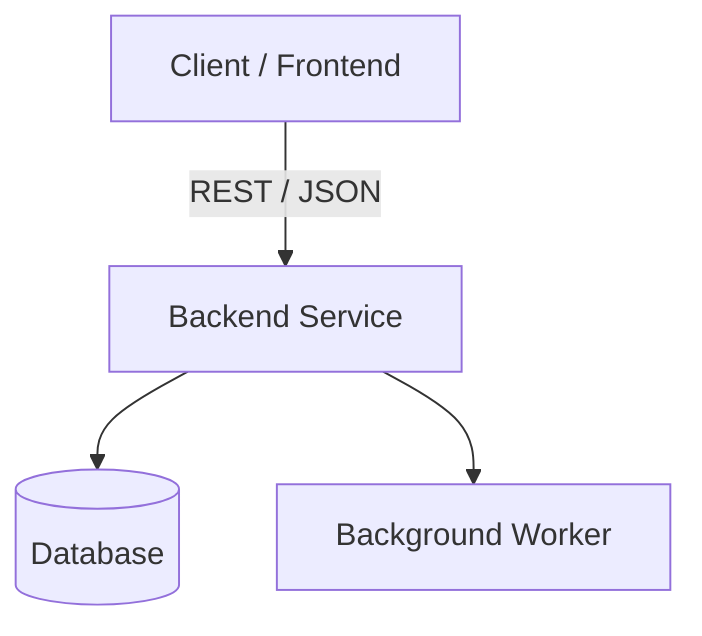

# Clean README Template

```markdown
# [Project Name]

[Short, factual brief (1-3 sentences) explaining exactly what this repository does, the problem it solves, and how it works under the hood. Avoid hype or buzzwords.]

[](https://opensource.org/licenses/MIT)

---

## Capabilities

- **[Capability 1]**: Concrete description of what this does technically.
- **[Capability 2]**: Concrete description of what this does technically.
- **[Capability 3]**: Concrete description of what this does technically.

---

## Architecture



---

## Quickstart

### Prerequisites
- Node.js >= 18.x (or Python >= 3.10)
- Git

### Setup & Run
```bash
# Clone repository
git clone https://github.com/your-username/repo-name.git
cd repo-name

# Install dependencies
npm install # or pip install -r requirements.txt

# Configure environment
cp .env.example .env

# Run locally
npm run dev # or python main.py
```

---

## Configuration

| Environment Variable | Description | Example |
| :--- | :--- | :--- |
| `PORT` | Server listening port | `3000` |
| `DATABASE_URL` | Database connection URL | `sqlite:///data.db` |
| `API_KEY` | Third-party service API key | `your_api_key_here` |

---

## Usage

```bash
# Example API request
curl -X GET http://localhost:3000/api/health
```

---

## Testing

```bash
npm test # or pytest -v
```

---

## License
MIT
```
