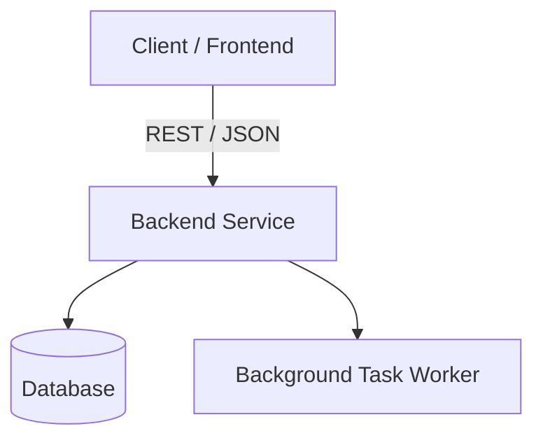

# Production README Template

```markdown
# [Project Name]

> [Short, compelling one-sentence summary of what this project does and the problem it solves.]

[](https://opensource.org/licenses/MIT)
[]()
[]()

---

## 🌟 Key Features

- **[Feature 1]**: Concise explanation of what this feature does.
- **[Feature 2]**: Concise explanation of what this feature does.
- **[Feature 3]**: Concise explanation of what this feature does.

---

## 🏗️ Architecture



---

## 🚀 Quickstart

### Prerequisites
- Node.js >= 18.x / Python >= 3.10
- Git

### Installation
```bash
# Clone the repository
git clone https://github.com/your-username/repo-name.git
cd repo-name

# Install dependencies
npm install # or pip install -r requirements.txt
```

### Configuration
Copy the example environment file and update with your credentials:
```bash
cp .env.example .env
```

| Variable | Description | Default |
| :--- | :--- | :--- |
| `PORT` | Local server port | `3000` |
| `DATABASE_URL` | Database connection string | `sqlite:///dev.db` |
| `API_KEY` | Third-party service API key | `""` |

### Running the Application
```bash
npm run dev # or python main.py
```

---

## 📖 Usage Examples

```bash
# Example curl request to test health
curl -X GET http://localhost:3000/api/health
```

---

## 🧪 Testing

```bash
npm test # or pytest -v
```

---

## 🤝 Contributing

1. Fork the Project
2. Create your Feature Branch (`git checkout -b feature/AmazingFeature`)
3. Commit your Changes (`git commit -m 'feat: add amazing feature'`)
4. Push to the Branch (`git push origin feature/AmazingFeature`)
5. Open a Pull Request

---

## 📄 License
Distributed under the MIT License. See `LICENSE` for more information.
```
