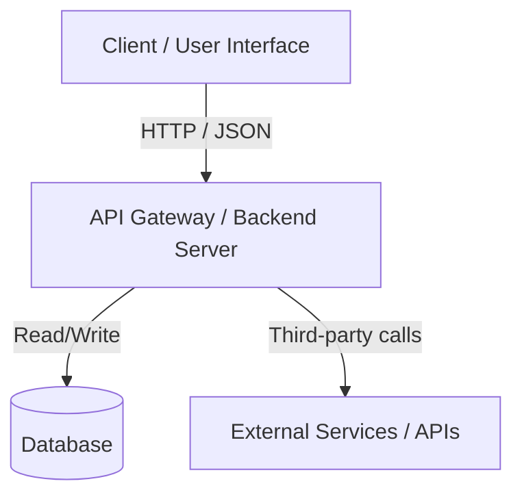

# Technical Design Document (TDD) Template

## 1. System Overview
- **Project Name**: [Name]
- **Summary**: Concise 2-3 sentence overview of the system's purpose.
- **Goals**: What this architecture accomplishes.
- **Non-Goals**: Explicitly out-of-scope items for the initial version.

---

## 2. Technology Stack & Rationale
| Layer | Technology | Justification |
| :--- | :--- | :--- |
| **Frontend / Interface** | e.g. React + Vite / CLI / Flutter | Speed of development, ecosystem maturity |
| **Backend / API** | e.g. FastAPI / Node.js / Go | Performance, asynchronous I/O, type safety |
| **Data Layer** | e.g. SQLite / PostgreSQL / Redis | Schema flexibility, query complexity |
| **Auth & Security** | e.g. JWT / OAuth2 / API Key | Simplicity and security trade-offs |

---

## 3. High-Level Architecture Diagram


---

## 4. Data Models & API Contracts
### Database Schema
```sql
-- Core table definitions with primary and foreign keys
CREATE TABLE users (
    id VARCHAR(36) PRIMARY KEY,
    email VARCHAR(255) UNIQUE NOT NULL,
    created_at TIMESTAMP DEFAULT CURRENT_TIMESTAMP
);
```

### Core API Endpoints
- `GET /api/v1/resource`: Fetch list of resources.
- `POST /api/v1/resource`: Create a new resource.
  - **Request Body**:
    ```json
    { "title": "Example", "enabled": true }
    ```
  - **Response (201 Created)**:
    ```json
    { "id": "123", "title": "Example", "enabled": true }
    ```

---

## 5. Security, Observability & Error Handling
- **Authentication**: How requests are validated.
- **Error Strategy**: Standardized error payloads (`{ "error": { "code": 404, "message": "..." } }`).
- **Telemetry**: Structured logging and health checks (`/healthz`).

---

## 6. Implementation Checklist
- [ ] Phase 1: Initialize directory, dependencies, and environment schema.
- [ ] Phase 2: Implement data models and migration scripts.
- [ ] Phase 3: Implement core business logic endpoints and handlers.
- [ ] Phase 4: Wire UI/CLI integration and error handling.
- [ ] Phase 5: Automated test suite verification and documentation.
