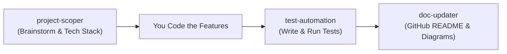

# Agent Toolkit

> All of my developer skills designed for **Google Antigravity** and **Gemini CLI (`agy`)**.

[](https://opensource.org/licenses/MIT)
[]()
[]()

---

## Overview

I am creating this toolkit to better define the agents I use everyday. I will continually update this toolkit with the agents I build.



Each agent conforms to the **Antigravity Customization System** standard.

---

## The Agents

### 1. [project-scoper](.agents/skills/project-scoper/SKILL.md)
* **Role**: Brainstorming, scope definition, and technical roadmapping.
* **Key Capabilities**:
  - Refines loose ideas into concrete project scopes and prevents scope creep.
  - Recommends modern, fast-to-develop stacks tailored to your project scale.
  - Designs database schemas (SQL/NoSQL) and API endpoints.
  - Generates clear Mermaid system architecture diagrams and milestone checklists.

### 2. [test-automation](.agents/skills/test-automation/SKILL.md)
* **Role**: Automated test authoring, test execution, and debugging.
* **Key Capabilities**:
  - Auto-detects test runners (`pytest`, `vitest`, `jest`, `go test`, `cargo test`).
  - Authors comprehensive unit and integration tests covering edge cases (empty states, boundary values, nulls).
  - Stubs/mocks external network calls and databases cleanly.
  - **Runs tests autonomously in your terminal** and iteratively patches failures until all suites pass.

### 3. [doc-updater](.agents/skills/doc-updater/SKILL.md)
* **Role**: Repository presentation, README generator, and developer documentation.
* **Key Capabilities**:
  - Reverse-engineers project dependencies, scripts, and environment configs.
  - Generates polished, GitHub-ready `README.md` files with tech badges.
  - Documents environment variables (`.env`), prerequisites, and quickstarts.
  - Creates Mermaid diagrams illustrating data flows and architectures.

---

## How to Use

### 1. In Antigravity (IDE & Desktop)
Skills placed in `.agents/skills/` are automatically discovered. You can trigger them naturally or with slash commands:

- **Brainstorm & Scope**:
  > *"I want to build a tool that generates Spotify playlists based on weather in my city. Act as project-scoper to define the scope, tech stack, and milestone plan."*
  > Or trigger via `/plan` or `/grill-me`.

- **Test Generation & Verification**:
  > *"Use test-automation to write unit tests for `src/utils.ts` and run them in the terminal to verify they pass."*

- **Update Documentation**:
  > *"Use doc-updater to scan this repo and generate a clean README.md with an architecture diagram before I push to GitHub."*

### 2. In Gemini CLI (`agy` / `gemini`)
Run them headlessly or pipe command outputs directly:

```bash
# Brainstorm and scope a project from the terminal:
agy "Use project-scoper to outline a lightweight FastAPI + SQLite backend for an expense tracker"

# Generate and verify tests headlessly:
agy "Use test-automation to create tests for utils/date.py and run pytest"

# Pipe test errors back to the agent for diagnosis and auto-fixing:
pytest | agy "Tests are failing. Use test-automation to fix the code and make tests pass."

# Update docs right before pushing to GitHub:
git status | agy "Use doc-updater to update README.md for the new features I just built"
```

---

## Installation & Setup

### Option A: Use in a Specific Project
Copy the `.agents/` folder into any project's root directory:
```bash
cp -r /path/to/agent_skills/.agents /path/to/my-project/
```

### Option B: Install Globally (Available Across All Projects)
Copy the skills into your machine's global Gemini configuration:
```bash
mkdir -p ~/.gemini/config/skills
cp -r .agents/skills/* ~/.gemini/config/skills/
```

---

## 📁 Repository Structure

```text
.
├── .agents/
│   └── skills/
│       ├── project-scoper/
│       │   ├── SKILL.md
│       │   └── references/
│       │       └── architecture-template.md
│       ├── test-automation/
│       │   ├── SKILL.md
│       │   └── references/
│       │       └── testing-strategy.md
│       └── doc-updater/
│           ├── SKILL.md
│           └── references/
│               └── readme-template.md
├── .gitignore
├── LICENSE
└── README.md
```

---

## License
This project is open-source under the [MIT License](LICENSE).
